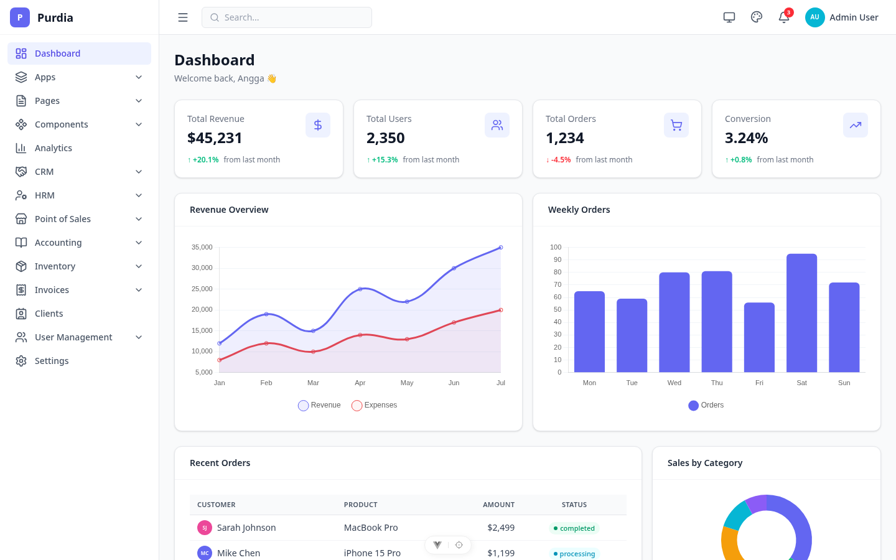
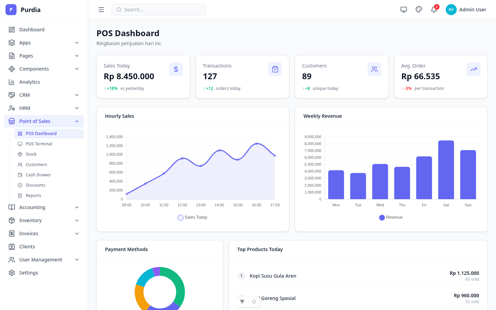
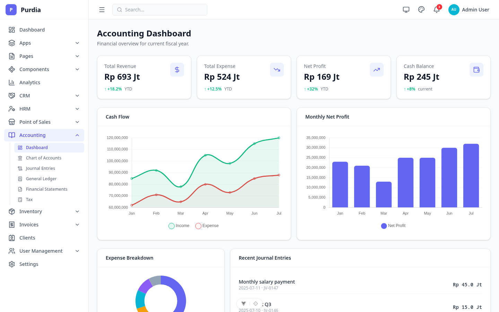
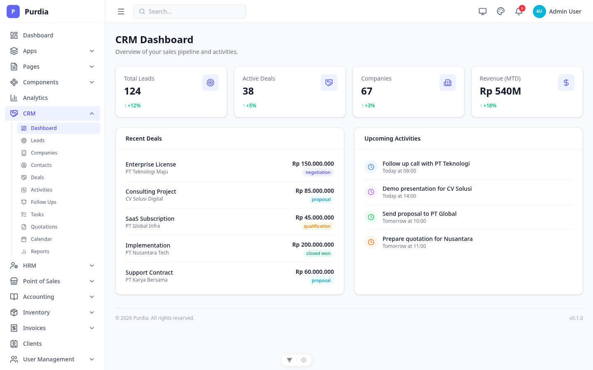
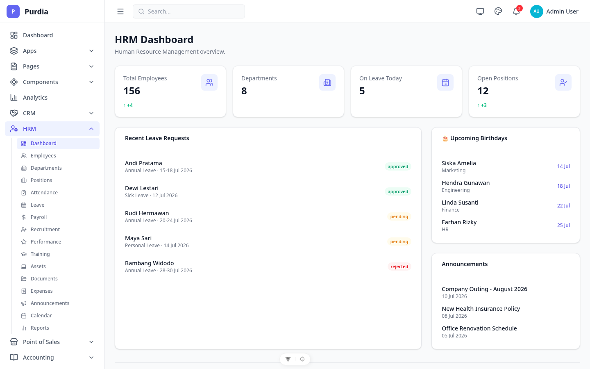
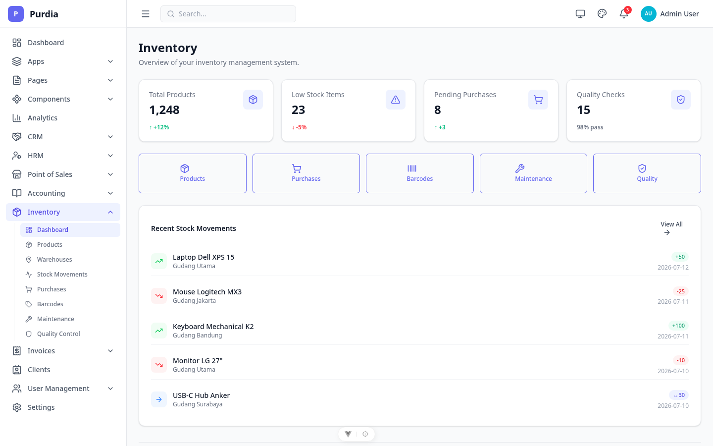

<p align="center">
  
</p>

<h1 align="center">Purdia</h1>

<p align="center">
A production-ready Vue 3 admin dashboard built for real business applications.
</p>

<p align="center">
  
  
  
  
  
  <a href="https://saweria.co/anggagewor"></a>
</p>

---

## Screenshots

| Dashboard | POS | Accounting |
|-----------|-----|------------|
|  |  |  |

| CRM | HRM | Inventory |
|-----|-----|-----------|
|  |  |  |

> **Mock Auth Enabled:** Any email/password combination works. Semua halaman bisa di-capture otomatis — lihat [tools/screenshots](./tools/screenshots/) untuk setup.

[View all screenshots →](./docs/screenshots/)

---

## Why Purdia?

- **Real business modules.** CRM, HRM, POS, Accounting, Inventory — 200+ pages of production-style patterns, not isolated demos.
- **Package-first architecture.** 12 internal `@purdia/*` packages — each designed to be published to npm when ready.
- **Built from scratch.** No PrimeVue, no Vuetify, no external UI framework. 40+ handcrafted components.
- **Thin client by design.** The frontend handles presentation. Business logic belongs in your backend API.
- **No vendor lock-in.** Consume the whole dashboard, or cherry-pick individual packages.

---

## Features

### Core UI

- 40+ handcrafted components with TypeScript props, variants, and sizes
- Dark/light theme with per-user persistence
- 8 switchable color themes
- Collapsible sidebar with icon-only mode and flyout submenus
- Toast notifications with auto-dismiss, progress bar, API error integration

### Developer Experience

- 12 npm-ready internal packages
- `useApi`, `usePagination`, `useToast`, `useI18n`, `useRbac` composables
- AES-GCM encrypted localStorage via Web Crypto API
- Composable-based i18n with 3 locales (EN, ID, JA)
- RBAC with `v-permission` directive and `useRbac()` composable

### Application Modules

- 200+ pages across CRM, HRM, POS, Accounting, Inventory, Invoices
- App pages: Chat, Email, Calendar, Timeline, Profile
- Marketing pages: Landing, Pricing with monthly/yearly toggle
- QR self-order for POS (public mobile page, no auth required)
- Error pages: 404, 403, 500, Maintenance with countdown

→ [Full component list](./docs/components.md) | [Module docs](./docs/modules/)

---

## Quick Start

```bash
git clone https://github.com/anggagewor/purdia.git
cd purdia
npm install
npm run dev
```

No build step required for packages — Vite resolves workspace sources directly.

```bash
# Production
npm run build
npm run preview
```

> **Requirements:** Node.js `^22.18.0 || >=24.12.0` (see `.nvmrc`), npm 11+

---

## Packages

12 internal `@purdia/*` packages. Each can evolve independently while remaining part of the same workspace.

| Package | Description |
|---------|-------------|
| `@purdia/ui` | 40+ Vue base components |
| `@purdia/charts` | Chart.js wrappers (Line, Bar, Doughnut) |
| `@purdia/toast` | Toast notification system |
| `@purdia/composables` | `useApi` + `usePagination` |
| `@purdia/http` | Axios wrapper + token refresh |
| `@purdia/crypto` | AES-GCM encrypted localStorage |
| `@purdia/auth` | Auth store + route guard |
| `@purdia/theme` | Dark/light + color switching |
| `@purdia/tailwind` | Tailwind v4 theme tokens |
| `@purdia/utils` | Shared utility functions |
| `@purdia/tsconfig` | Shared TypeScript configs |
| `@purdia/eslint-config` | Shared ESLint config |

→ [Full package documentation](./docs/packages.md)

---

## Modules

| Module | Docs |
|--------|------|
| 📊 CRM — Leads, deals, contacts, pipeline, quotations | [docs](./docs/modules/crm.md) |
| 👥 HRM — Employees, attendance, payroll, recruitment, performance | [docs](./docs/modules/hrm.md) |
| 🏪 POS — Terminal, QR self-order, multi-payment, hold orders | [docs](./docs/modules/pos.md) |
| 📒 Accounting — Chart of accounts, journals, ledger, statements | [docs](./docs/modules/accounting.md) |
| 📦 Inventory — Products, warehouses, stock, barcodes, QC | [docs](./docs/modules/inventory.md) |
| 🧾 Invoices — Invoice CRUD, line items, tax, payment tracking | [docs](./docs/modules/invoices.md) |
| 📋 Clients — Client CRUD with company/individual types | |
| 📋 Projects — Kanban board with drag-and-drop | |
| 👤 Users — Users, Roles, Permissions CRUD | |

---

## Architecture

Purdia is a package-first monorepo where reusable libraries are developed, tested, and validated before being published to npm as standalone packages.

- **Package isolation:** Core utilities live in `packages/` because when they're stable, they go straight to npm — no refactoring from `src/` needed.
- **Stateless frontend:** The client only holds transient UI state (auth sessions, theme, sidebar). All business logic lives in the backend API.
- **Template vs. application boundary:** Purdia provides UI primitives, design system, and utility contracts. Domain models and business workflows belong in whatever app consumes these packages.

---

## Tech Stack

| Technology | Version | Purpose |
|------------|---------|---------|
| Vue | 3.5 | Composition API, `<script setup>` |
| TypeScript | 6 | Full type safety |
| Tailwind CSS | 4 | Utility-first styling with CSS variable theming |
| Pinia | 3 | State management |
| Vue Router | 5 | Route modules, async guards |
| Axios | 1.x | HTTP client with interceptors |
| Chart.js | 4 | Data visualization |
| Tiptap | 3 | Headless WYSIWYG editor |
| Lucide | 1.x | Icon library |
| Vite | 8 | Dev server and build tool |

---

## Project Structure

```
purdia/
├── packages/          # @purdia/* internal packages (npm-ready)
├── src/
│   ├── components/    # Layout components (sidebar, topbar)
│   ├── lib/           # Internal libraries (i18n, rbac)
│   ├── pages/         # All page components by module
│   ├── router/        # Vue Router with route modules
│   └── stores/        # Pinia stores
├── docs/              # Documentation & screenshots
└── tools/             # Dev tooling (screenshot automation)
```

---

## Development

| Script | Command | Description |
|--------|---------|-------------|
| Dev | `npm run dev` | Start Vite dev server |
| Build | `npm run build` | Type-check + production build |
| Preview | `npm run preview` | Preview production build |
| Type Check | `npm run type-check` | Run `vue-tsc` |
| Lint | `npm run lint` | ESLint check |
| Lint Fix | `npm run lint:fix` | Auto-fix lint issues |
| Test | `npm test` | Run Vitest |
| Coverage | `npm run test:coverage` | Tests with coverage |
| Format | `npm run format` | Format with oxfmt |

**Tooling:** ESLint 9 (flat config) · [oxfmt](https://github.com/nicolo-ribaudo/oxfmt) (Rust-based formatter) · Vitest 3 · vue-tsc

---

## Contributing

Contributions are welcome. Feel free to open issues or submit pull requests.

1. Fork the repository
2. Create your feature branch (`git checkout -b feature/amazing-feature`)
3. Run checks before committing:
   ```bash
   npm run lint && npm test && npm run type-check
   ```
4. Commit and push
5. Open a Pull Request

---

## About

Purdia started as the dashboard I wanted but couldn't find. Every package, component, and feature exists because it solved a real problem in one of my own applications. This repository evolves alongside the products I build — expect continuous improvements instead of artificial roadmap releases.

Contributions, bug reports, and ideas are always welcome.

---

## License

MIT License — free to use, modify, and distribute.

## Star History

<a href="https://www.star-history.com/?repos=anggagewor%2Fpurdia&type=date&logscale=&legend=bottom-right">
 <picture>
   <source media="(prefers-color-scheme: dark)" srcset="https://api.star-history.com/chart?repos=anggagewor/purdia&type=date&theme=dark&logscale&legend=bottom-right&sealed_token=JE9oknV5HScsOXX6hrr2UYZhU1_m8BMF0jcJztqB0BiU8HWqQreax4JpCr0nPJfc0jL_a_XjPaJrMf7lfsn7tB9ebbsTNY1XaUoK7fb-jp4pJFVYJk-MoA" />
   <source media="(prefers-color-scheme: light)" srcset="https://api.star-history.com/chart?repos=anggagewor/purdia&type=date&logscale&legend=bottom-right&sealed_token=JE9oknV5HScsOXX6hrr2UYZhU1_m8BMF0jcJztqB0BiU8HWqQreax4JpCr0nPJfc0jL_a_XjPaJrMf7lfsn7tB9ebbsTNY1XaUoK7fb-jp4pJFVYJk-MoA" />
   
 </picture>
</a>
