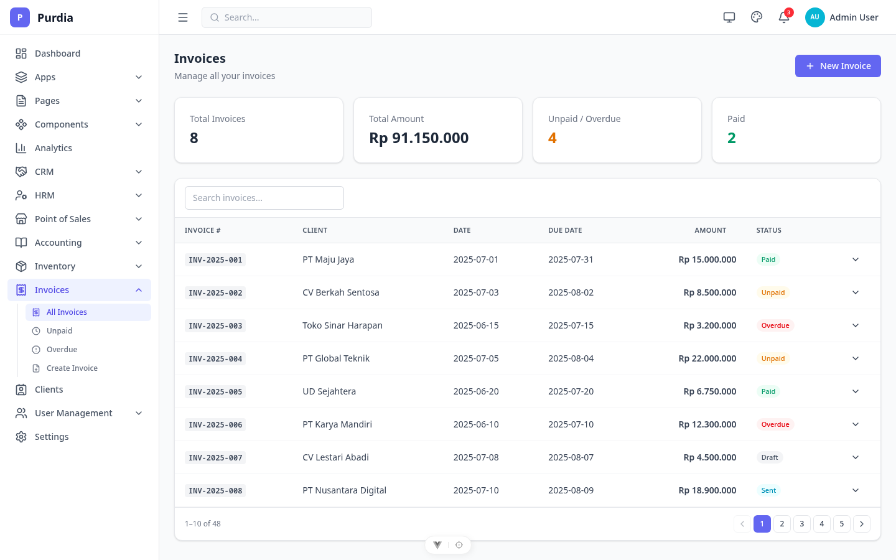
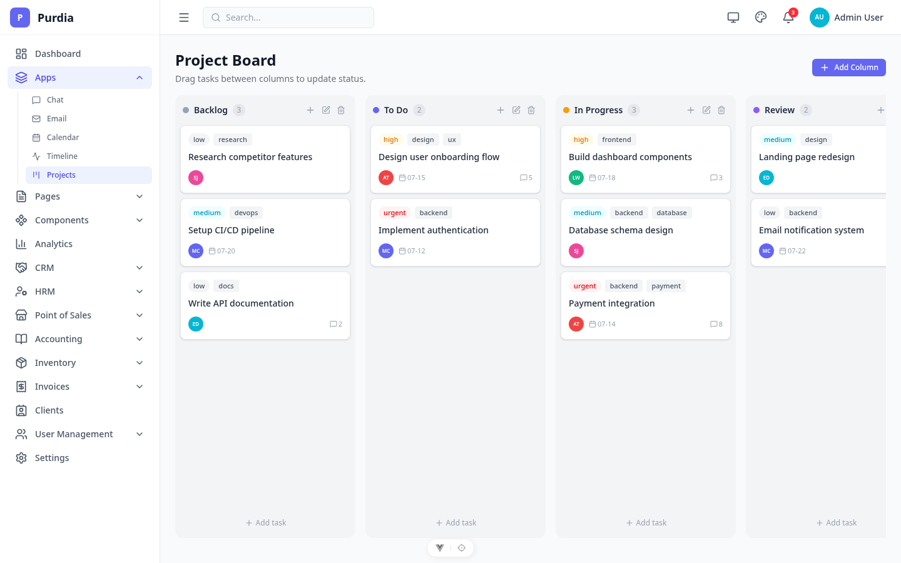
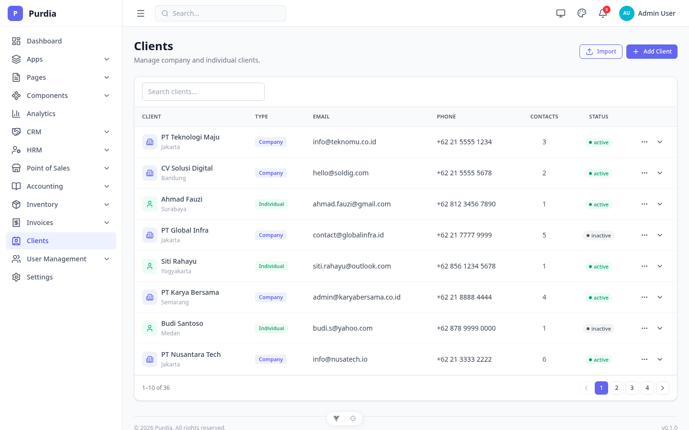
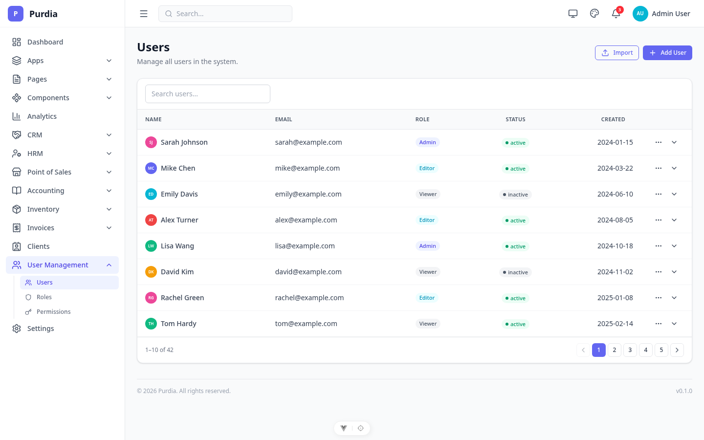
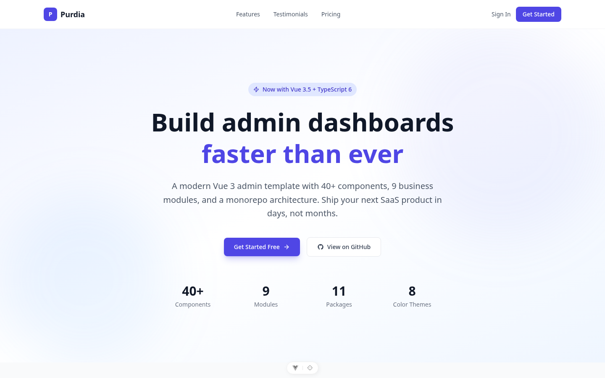
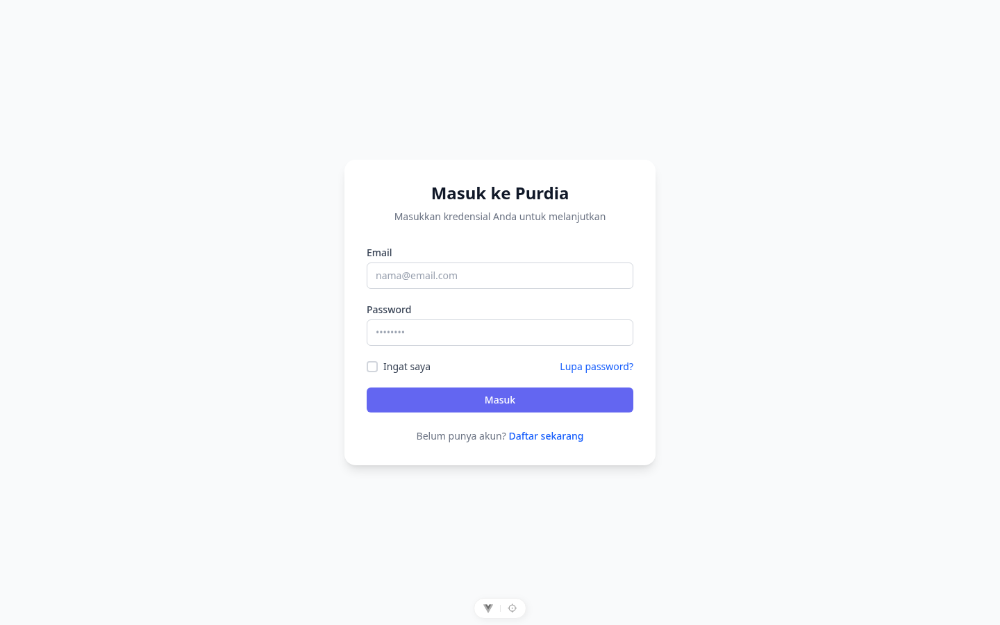
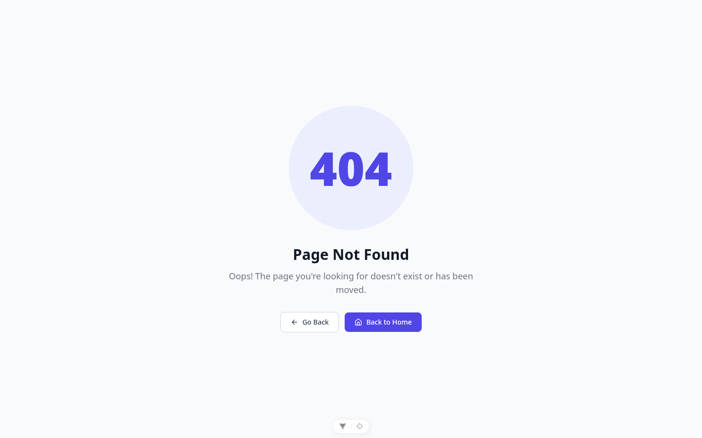

<p align="center">
  
</p>

<h1 align="center">Purdia</h1>

<p align="center">
Modern Vue 3 Admin Dashboard built with TypeScript & Tailwind CSS 4.
</p>

<p align="center">
  
  
  
  
  
  <a href="https://saweria.co/anggagewor"></a>
</p>

---

## 📐 Architecture & Design Philosophy

Purdia is **not** a monolithic frontend app — it's an incubation environment for publishable packages that happen to ship with a full-featured admin UI.

### Key Architectural Decisions

- **Package Isolation (NPM-Ready):** Core utilities (`@purdia/http`, `@purdia/crypto`, `@purdia/ui`) live in `packages/` because when they're proven and stable, they go straight to npm — no refactoring from `src/` needed. The monorepo is the workshop; npm is the destination.

- **Stateless Presentation Layer:** The frontend only holds transient UI state (auth sessions, theme, sidebar). All heavy lifting — transactions, reconciliation, business rules — lives in the backend API. The client just renders what the API gives it.

- **Template vs. Application Boundary:** Purdia provides UI primitives, design system, and utility contracts. Business-specific schemas, domain models, and workflows belong in whatever app consumes these packages.

---

## ✨ Features

- 📄 **200+ Pages** — Full-featured app modules (CRM, HRM, POS, Accounting, Inventory, Invoices, and more)
- 🧩 **40+ UI Components** — Built from scratch, no external UI library
- 🌙 **Dark Mode** — Full light/dark theme with per-user persistence
- 🎨 **8 Color Themes** — Switchable primary colors (Indigo, Blue, Emerald, Rose, Amber, Teal, Violet, Slate)
- 🔐 **Secure Storage** — AES-GCM encrypted localStorage via Web Crypto API
- 🌐 **Internationalization (i18n)** — Composable-based multi-language with JSON locale files (EN, ID, JA)
- 🛡️ **RBAC** — Role-based access control with `v-permission` directive and `useRbac()` composable
- 🔔 **Toast Notifications** — Global system with auto-dismiss, progress bar, API error integration
- 📦 **Composables** — `useApi`, `usePagination`, `useToast`, `useI18n`, `useRbac` for clean page logic
- 📱 **Collapsible Sidebar** — Icon-only mode with flyout popover submenus
- 📲 **QR Self-Order** — Public mobile menu page, customers scan & order from table
- 🏗️ **Monorepo Architecture** — 12 internal packages for maximum reusability
- 💬 **App Pages** — Chat, Email Client, Calendar, Timeline/Feed, Profile
- 🎯 **Landing & Marketing** — Landing page, Pricing page with monthly/yearly toggle
- 🚨 **Error Pages** — 404, 403, 500, Maintenance with illustrations and countdown

---

## 🖥️ Demo & Visuals

> **Mock Auth Enabled:** Any email/password combination works.

### 📸 All Module Screenshots

Semua halaman bisa di-capture otomatis — lihat [tools/screenshots](./tools/screenshots/) untuk setup.

| Category | Preview | All Pages |
|----------|---------|-----------|
| Dashboard |  | [View all](./docs/screenshots/dashboard/index.md) |
| POS |  | [View all](./docs/screenshots/pos/index.md) |
| Accounting |  | [View all](./docs/screenshots/accounting/index.md) |
| CRM |  | [View all](./docs/screenshots/crm/index.md) |
| HRM |  | [View all](./docs/screenshots/hrm/index.md) |
| Inventory |  | [View all](./docs/screenshots/inventory/index.md) |
| Invoices |  | [View all](./docs/screenshots/invoices/index.md) |
| Projects |  | [View all](./docs/screenshots/projects/index.md) |
| Clients |  | [View all](./docs/screenshots/clients/index.md) |
| Users & Roles |  | [View all](./docs/screenshots/users/index.md) |
| Pages |  | [View all](./docs/screenshots/pages/index.md) |
| Auth |  | [View all](./docs/screenshots/auth/index.md) |
| Error Pages |  | [View all](./docs/screenshots/errors/index.md) |

---

## ⚡ Quick Start

```bash
git clone https://github.com/anggagewor/purdia.git
cd purdia
npm install
npm run dev
```

No build step required for packages — Vite resolves workspace sources directly.

---

## 📱 App Pages

Full-featured application pages ready to use as reference or starting point.

| Page | Route | Description |
|------|-------|-------------|
| Chat | `/chat` | WhatsApp-style messaging with contacts, status indicators, message bubbles |
| Email | `/email` | Gmail-style inbox with folders, labels, compose, read/unread, star |
| Calendar | `/calendar` | Month grid with events, click-to-select, event details sidebar |
| Timeline | `/timeline` | Social media feed with posts, likes, comments, tags, milestones |
| Profile | `/profile` | Cover photo, avatar, bio, tabs (Activity, Settings, Security) |
| Pricing | `/pricing` | 3-tier cards with monthly/yearly toggle, feature comparison |
| Landing | `/landing` | Hero, features grid, testimonials, CTA, footer |
| 404 | `/404-demo` | Not Found page with illustration |
| 403 | `/403` | Access Denied page |
| 500 | `/500` | Server Error with retry button |
| Maintenance | `/maintenance` | Countdown timer with status updates |

---

## 🏢 Modules

| Module | Description | Docs |
|--------|-------------|------|
| 📊 CRM | Leads, deals, contacts, pipeline, quotations | [docs/modules/crm.md](./docs/modules/crm.md) |
| 👥 HRM | Employees, attendance, payroll, recruitment, performance | [docs/modules/hrm.md](./docs/modules/hrm.md) |
| 🏪 POS | Terminal, QR self-order, multi-payment, hold orders | [docs/modules/pos.md](./docs/modules/pos.md) |
| 📒 Accounting | Chart of accounts, journals, ledger, statements | [docs/modules/accounting.md](./docs/modules/accounting.md) |
| 📦 Inventory | Products, warehouses, stock, barcodes, QC | [docs/modules/inventory.md](./docs/modules/inventory.md) |
| 🧾 Invoices | Invoice CRUD, line items, tax, payment tracking | [docs/modules/invoices.md](./docs/modules/invoices.md) |
| 📋 Clients | Client CRUD with company/individual types | |
| 📋 Projects | Kanban board with drag-and-drop | |
| 👤 Users | Users, Roles, Permissions CRUD | |

---

## 🧱 Components

40+ components with TypeScript props, variants, and sizes. → [Full list](./docs/components.md)

### Component Categories

| Category | Components |
|----------|-----------|
| **Form** | Input, Select, Toggle, Date Picker, File Upload, Editor, Textarea, Checkbox, Radio, Number Input, Slider, Rating, Color Picker |
| **Display** | Card, Badge, Avatar, Table, Alert, Progress, Stat Card, Skeleton, Charts, Tag, Spinner, Accordion, Timeline, Steps, Empty State, Divider, Kbd, Avatar Group, Notifications |
| **Navigation** | Button, Tabs, Pagination, Breadcrumb |
| **Overlay & Layout** | Modal, Grid, Drawer, Tooltip, Popover, Tree View, Calendar, Command Palette, Context Menu |
| **Patterns** | Wizard Form, Print Layout, Data Table Advanced, Infinite Scroll, Code Block, Markdown Renderer, i18n Demo, RBAC Demo |

---

## 🔧 DX Features

| Feature | Path | Description |
|---------|------|-------------|
| **i18n** | `src/lib/i18n/` | Composable-based internationalization with `useI18n()`, JSON locale files (EN, ID, JA), reactive language switching, string interpolation |
| **RBAC** | `src/lib/rbac/` | `useRbac()` composable + `v-permission` directive, 4 mock roles (Admin, Manager, Editor, Viewer), graduated permissions |
| **Code Block** | `/examples/code-block` | Syntax highlighted display with line numbers, copy button, language tabs |
| **Markdown** | `/examples/markdown` | Zero-dep renderer with live editor, split view, supports tables/code/lists/images |
| **Wizard Form** | `/examples/wizard-form` | Multi-step form with validation, progress indicator, review step |
| **Print Layout** | `/examples/print-layout` | Invoice template with clean print CSS, A4 optimized |
| **Data Table Adv** | `/examples/data-table-advanced` | Column resize, pin, sort, search, inline editing |
| **Infinite Scroll** | `/examples/infinite-scroll` | IntersectionObserver-based lazy loading with progress |

---

## 📦 Packages

Monorepo with 12 internal `@purdia/*` packages. → [Full documentation](./docs/packages.md)

| Package | Description |
|---------|-------------|
| `@purdia/ui` | 40+ Vue base components |
| `@purdia/charts` | Chart.js wrappers (Line, Bar, Doughnut) |
| `@purdia/toast` | Toast notification system |
| `@purdia/composables` | `useApi` + `usePagination` |
| `@purdia/http` | Axios wrapper + token refresh |
| `@purdia/crypto` | AES-GCM encrypted localStorage |
| `@purdia/auth` | Auth store + route guard |
| `@purdia/theme` | Dark/light + color switching |
| `@purdia/tailwind` | Tailwind v4 theme tokens |
| `@purdia/utils` | Shared utility functions |
| `@purdia/tsconfig` | Shared TypeScript configs |
| `@purdia/eslint-config` | Shared ESLint config |

---

## 🛠 Tech Stack

| Technology | Version | Purpose |
|------------|---------|---------|
| Vue | 3.5 | Composition API, `<script setup>` |
| TypeScript | 6 | Full type safety |
| Tailwind CSS | 4 | Utility-first styling with CSS variable theming |
| Pinia | 3 | State management |
| Vue Router | 5 | File-based route modules, async guards |
| Axios | 1.x | HTTP client with interceptors |
| Chart.js | 4 | Data visualization |
| Tiptap | 3 | Headless WYSIWYG editor |
| Lucide | 1.x | 1000+ icons |
| Vite | 8 | Dev server and build tool |

---

## 📁 Project Structure

```
purdia/
├── packages/                    # Shared internal packages (@purdia/*)
│   ├── ui/                      # Vue base components
│   ├── charts/                  # Chart.js wrappers
│   ├── toast/                   # Notification system
│   ├── composables/             # useApi, usePagination
│   ├── http/                    # Axios wrapper + token refresh
│   ├── crypto/                  # Encrypted localStorage
│   ├── auth/                    # Auth store + route guard
│   ├── theme/                   # Dark/light + color switching
│   ├── tailwind/                # CSS theme tokens
│   ├── utils/                   # Shared utilities
│   ├── tsconfig/                # Shared TS configs
│   └── eslint-config/           # Shared lint rules
├── src/
│   ├── components/layout/       # DashboardLayout, SidebarNav, TopBar
│   ├── lib/                     # Internal libraries
│   │   ├── i18n/                # Internationalization system
│   │   └── rbac/                # Role-based access control
│   ├── pages/                   # All page components
│   │   ├── auth/                # Login, Register, Forgot Password
│   │   ├── errors/              # 404, 403, 500, Maintenance
│   │   ├── accounting/          # 6 sub-modules
│   │   ├── crm/                 # 11 sub-modules
│   │   ├── hrm/                 # 16 sub-modules
│   │   ├── inventory/           # 8 sub-modules
│   │   ├── invoices/            # Invoice CRUD
│   │   ├── pos/                 # POS Terminal, QR
│   │   ├── projects/            # Kanban board
│   │   ├── public/              # QR self-order (no auth)
│   │   ├── examples/            # Component showcase (50+ pages)
│   │   ├── ChatPage.vue         # Messaging UI
│   │   ├── EmailPage.vue        # Email client UI
│   │   ├── CalendarPage.vue     # Calendar view
│   │   ├── TimelinePage.vue     # Activity feed
│   │   ├── ProfilePage.vue      # User profile
│   │   ├── PricingPage.vue      # Pricing cards
│   │   └── LandingPage.vue      # Marketing landing
│   ├── router/                  # Vue Router with route modules
│   └── stores/                  # Pinia stores
├── docs/                        # Documentation & screenshots
└── package.json                 # Workspace root
```

---

## 🚀 Installation

```bash
# Clone
git clone https://github.com/anggagewor/purdia.git
cd purdia

# Install (includes all workspace packages)
npm install

# Development — no need to build packages, Vite resolves source directly
npm run dev

# Production build
npm run build

# Preview build
npm run preview
```

> **Note:** This is a monorepo with internal `@purdia/*` packages linked via npm workspaces. All packages export their source TypeScript/Vue files directly, so Vite can resolve and bundle them without a separate build step. Just `npm install` and `npm run dev` — that's it.

---

## 🧪 Development Scripts

| Script | Command | Description |
|--------|---------|-------------|
| Dev Server | `npm run dev` | Start Vite dev server |
| Build | `npm run build` | Type-check + production build |
| Preview | `npm run preview` | Preview production build |
| Type Check | `npm run type-check` | Run `vue-tsc` type checking |
| Lint | `npm run lint` | ESLint check (src + packages) |
| Lint Fix | `npm run lint:fix` | Auto-fix lint issues |
| Test | `npm test` | Run Vitest test suites |
| Test Watch | `npm run test:watch` | Vitest in watch mode |
| Test Coverage | `npm run test:coverage` | Run tests with coverage report |
| Format | `npm run format` | Format code with oxfmt |

### Tooling

- **Linter:** ESLint 9 (flat config) with `@purdia/eslint-config` — Vue 3 + TypeScript rules
- **Formatter:** [oxfmt](https://github.com/nicolo-ribaudo/oxfmt) — Rust-based, no semicolons, single quotes
- **Test Runner:** Vitest 3 — fast, Vite-native, with workspace alias support
- **Type Checker:** vue-tsc — full Vue + TypeScript validation

---

## ⚠️ Disclaimer

Purdia is a long-term project that I actively use as the foundation for my own applications. New features are added as real-world needs arise, which means development is continuous but not tied to a fixed release schedule. Contributions, bug reports, and ideas are always welcome.

---

## 🤝 Contributing

Contributions are welcome! Feel free to open issues or submit pull requests.

1. Fork the repository
2. Create your feature branch (`git checkout -b feature/amazing-feature`)
3. Make your changes
4. Run checks before committing:
   ```bash
   npm run lint        # ensure no lint errors
   npm test            # ensure tests pass
   npm run type-check  # ensure no type errors
   ```
5. Commit your changes (`git commit -m 'Add amazing feature'`)
6. Push to the branch (`git push origin feature/amazing-feature`)
7. Open a Pull Request

### Requirements

- Node.js `^22.18.0 || >=24.12.0` (see `.nvmrc`)
- npm 11+

## 📄 License

MIT License — free to use, modify, and distribute.
