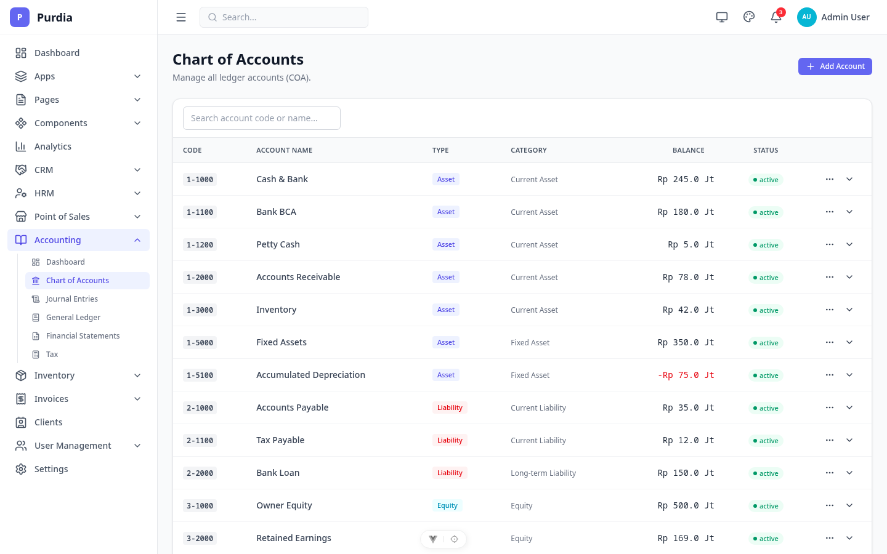
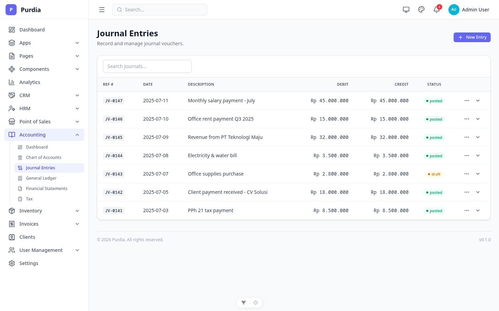
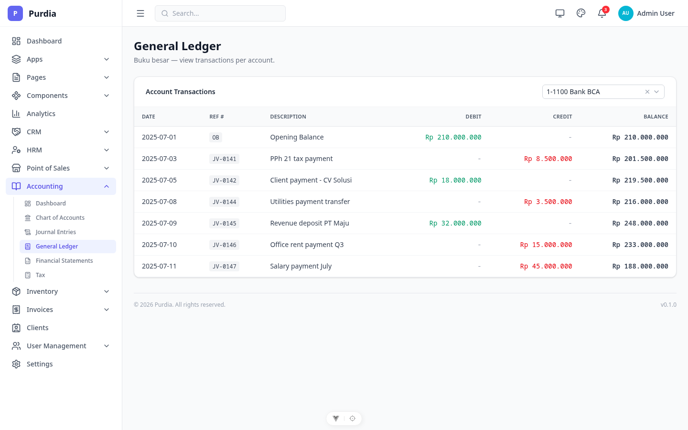
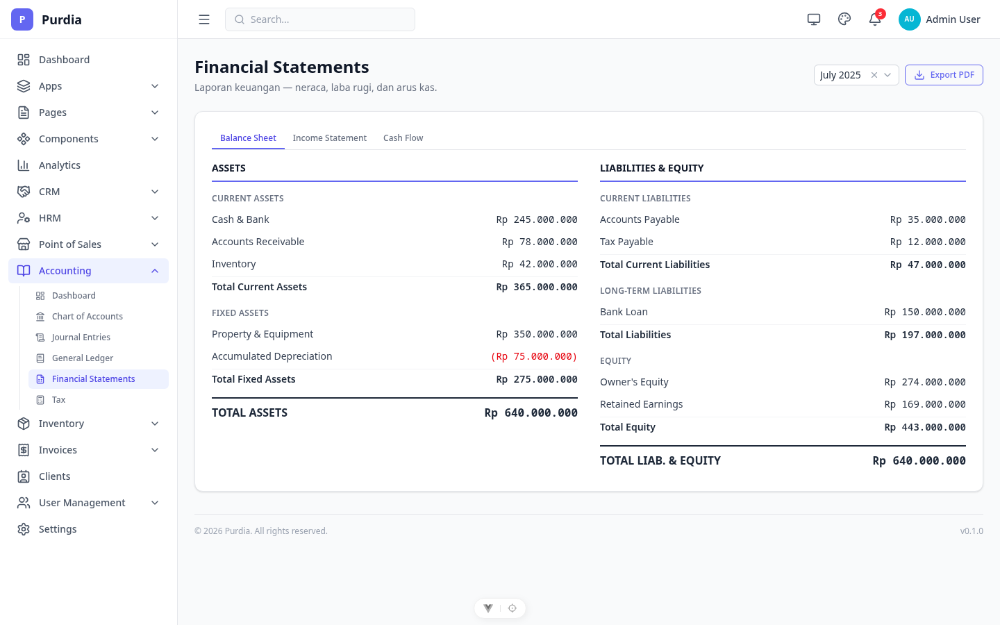
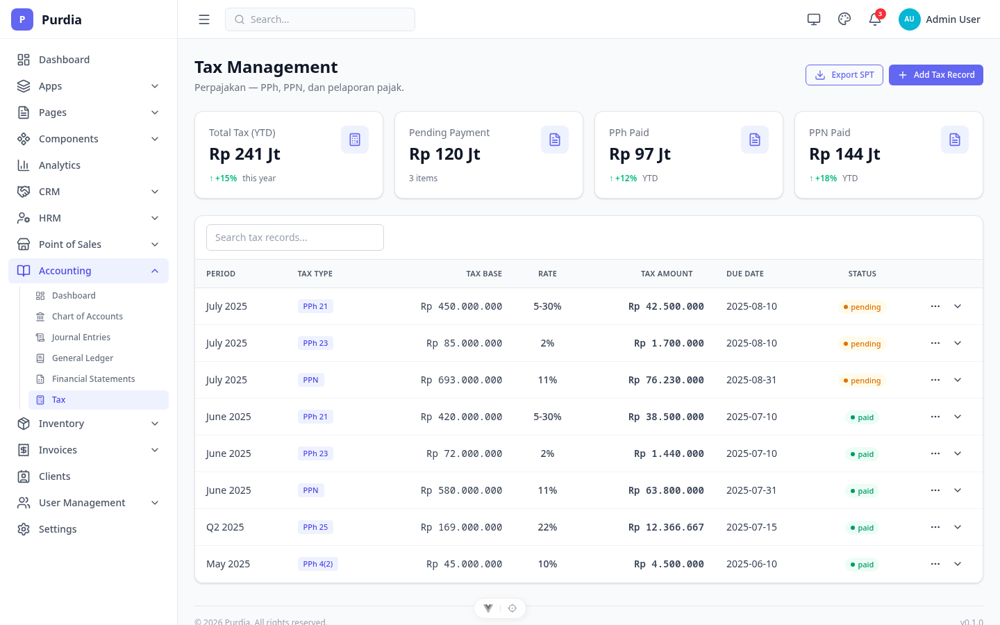

# Accounting

Modul akuntansi — chart of accounts, journal entries, ledger, financial statements, dan tax management.

## Pages

| Page | File | Route |
|------|------|-------|
| Dashboard | `dashboard.png` | `/accounting` |
| Chart of Accounts | `chart-of-accounts.png` | `/accounting/coa` |
| Journal Entries | `journal-entries.png` | `/accounting/journals` |
| General Ledger | `general-ledger.png` | `/accounting/ledger` |
| Financial Statements | `financial-statements.png` | `/accounting/statements` |
| Tax Management | `tax-management.png` | `/accounting/tax` |

## Preview

