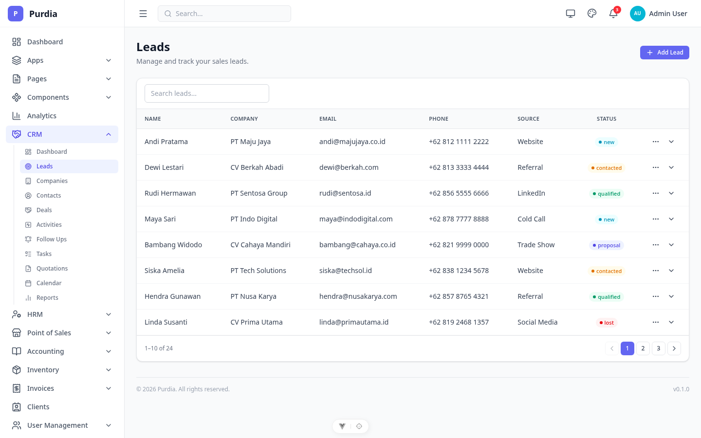
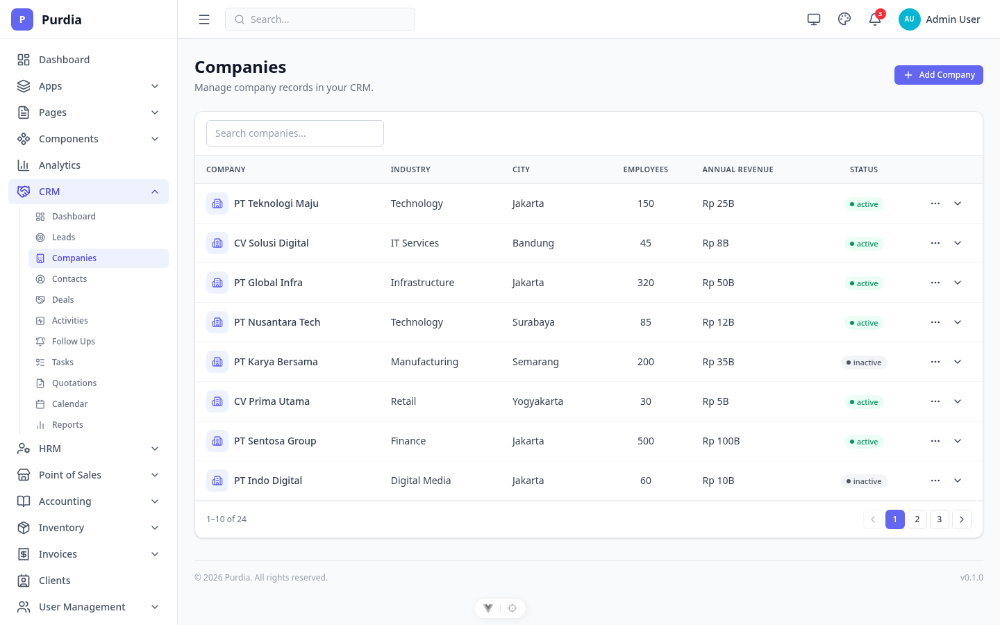
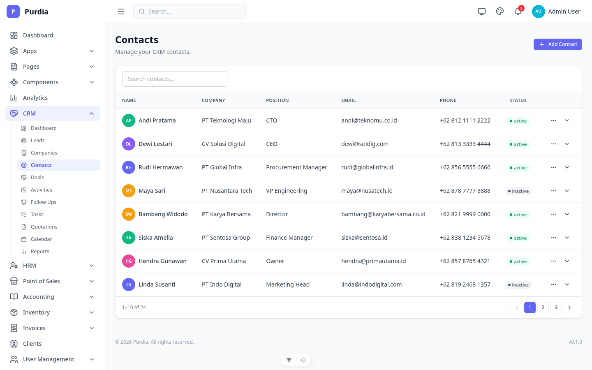
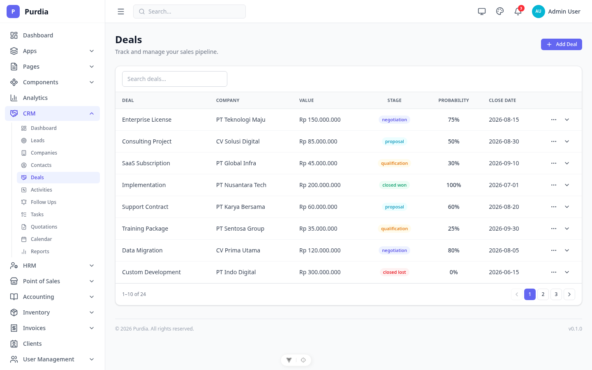
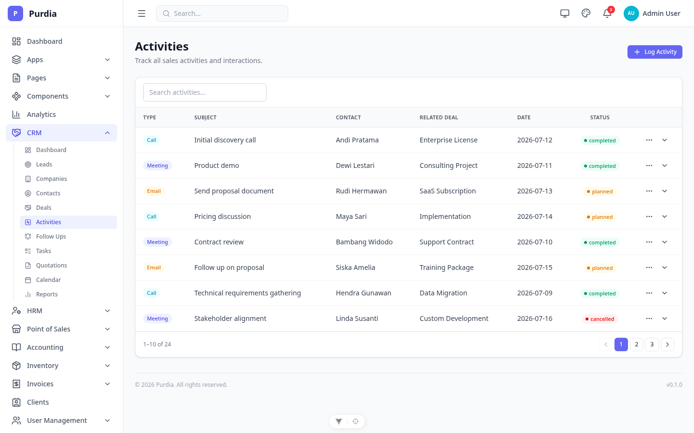
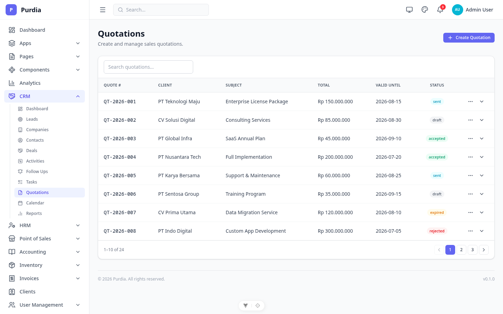
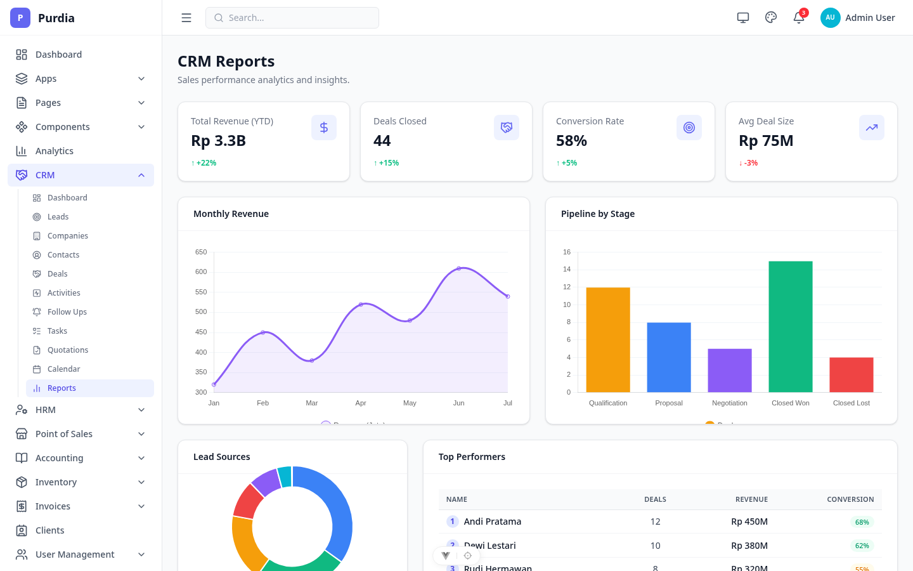

# CRM (Customer Relationship Management)

Modul CRM — leads, companies, contacts, deals, activities, quotations, dan reporting.

## Pages

| Page | File | Route |
|------|------|-------|
| Dashboard | `dashboard.png` | `/crm` |
| Leads | `leads.png` | `/crm/leads` |
| Companies | `companies.png` | `/crm/companies` |
| Contacts | `contacts.png` | `/crm/contacts` |
| Deals | `deals.png` | `/crm/deals` |
| Activities | `activities.png` | `/crm/activities` |
| Follow Ups | `follow-ups.png` | `/crm/follow-ups` |
| Tasks | `tasks.png` | `/crm/tasks` |
| Quotations | `quotations.png` | `/crm/quotations` |
| Calendar | `calendar.png` | `/crm/calendar` |
| Reports | `reports.png` | `/crm/reports` |

## Preview

