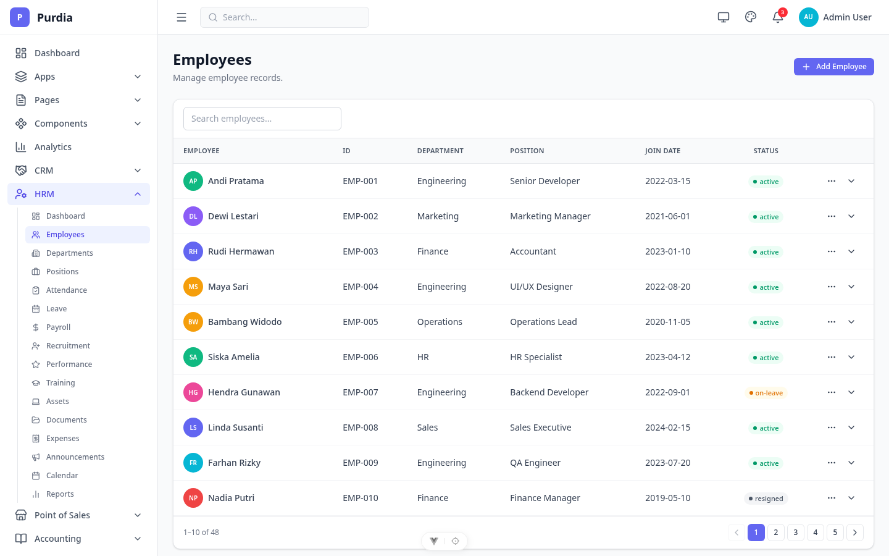
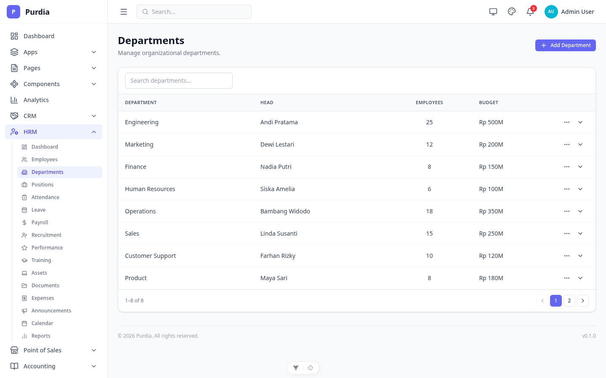
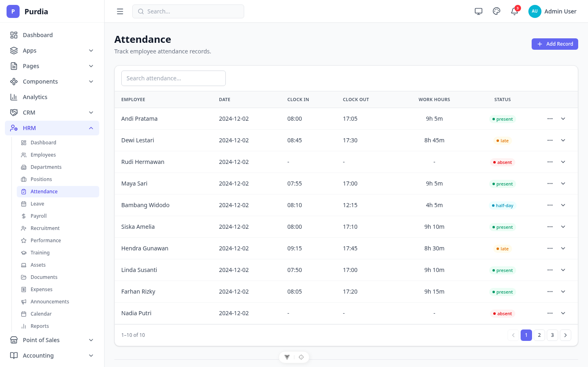
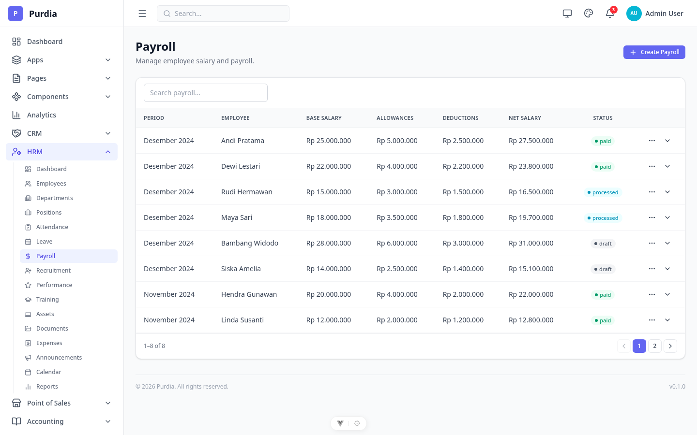
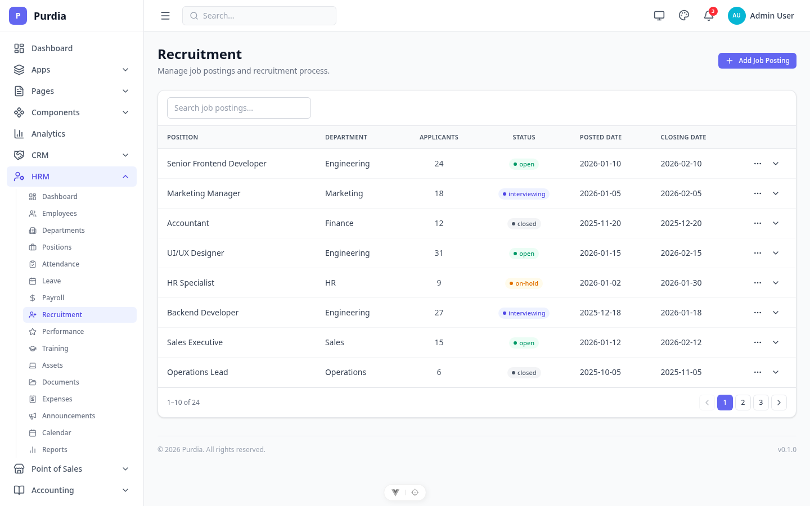
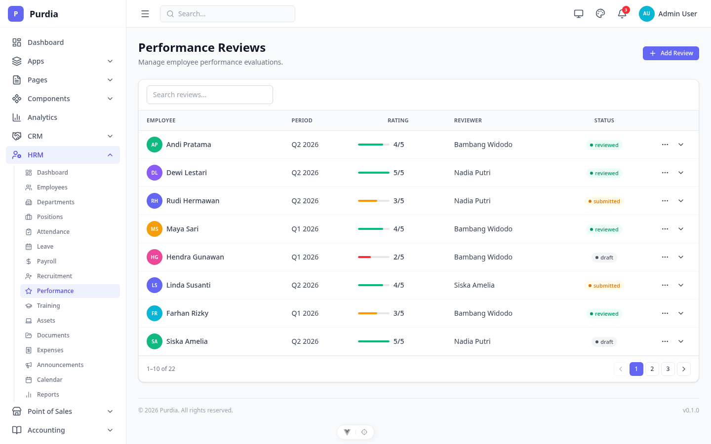
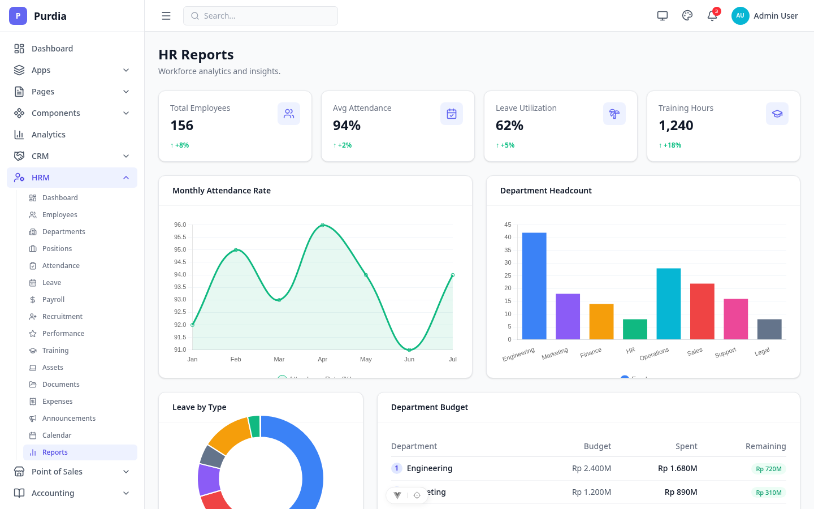

# HRM (Human Resource Management)

Modul HR — employees, departments, attendance, payroll, recruitment, performance, training, dan lainnya.

## Pages

| Page | File | Route |
|------|------|-------|
| Dashboard | `dashboard.png` | `/hrm` |
| Employees | `employees.png` | `/hrm/employees` |
| Departments | `departments.png` | `/hrm/departments` |
| Positions | `positions.png` | `/hrm/positions` |
| Attendance | `attendance.png` | `/hrm/attendance` |
| Leave | `leave.png` | `/hrm/leave` |
| Payroll | `payroll.png` | `/hrm/payroll` |
| Recruitment | `recruitment.png` | `/hrm/recruitment` |
| Performance | `performance.png` | `/hrm/performance` |
| Training | `training.png` | `/hrm/training` |
| Assets | `assets.png` | `/hrm/assets` |
| Documents | `documents.png` | `/hrm/documents` |
| Expenses | `expenses.png` | `/hrm/expenses` |
| Announcements | `announcements.png` | `/hrm/announcements` |
| Calendar | `calendar.png` | `/hrm/calendar` |
| Reports | `reports.png` | `/hrm/reports` |

## Preview

