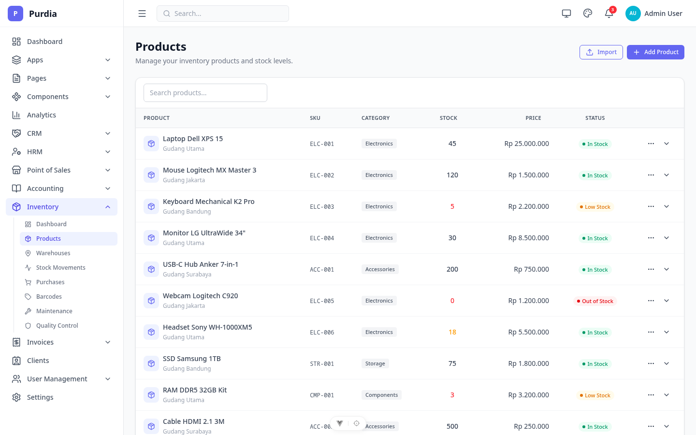
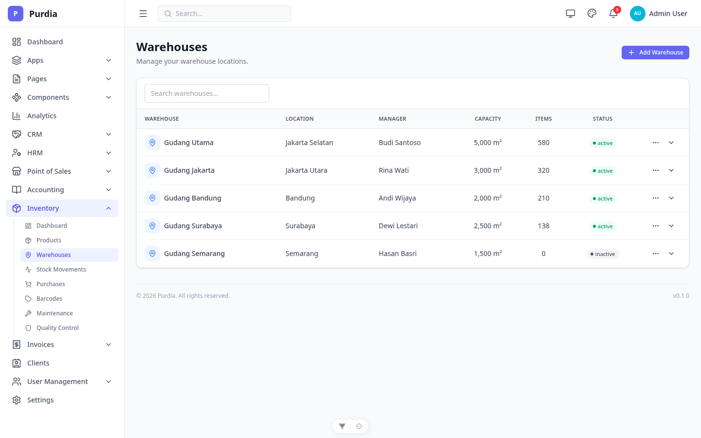
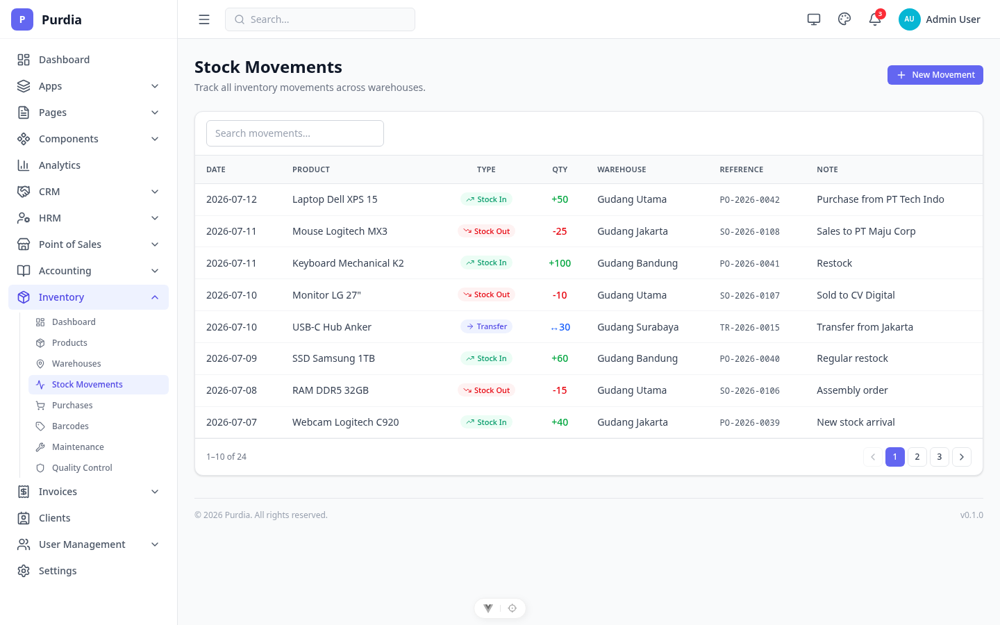
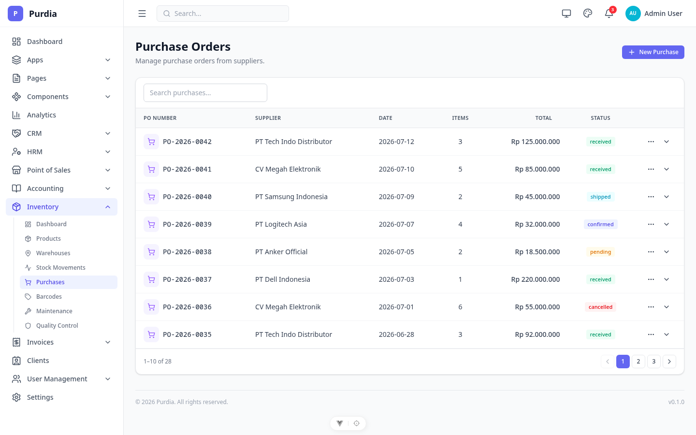
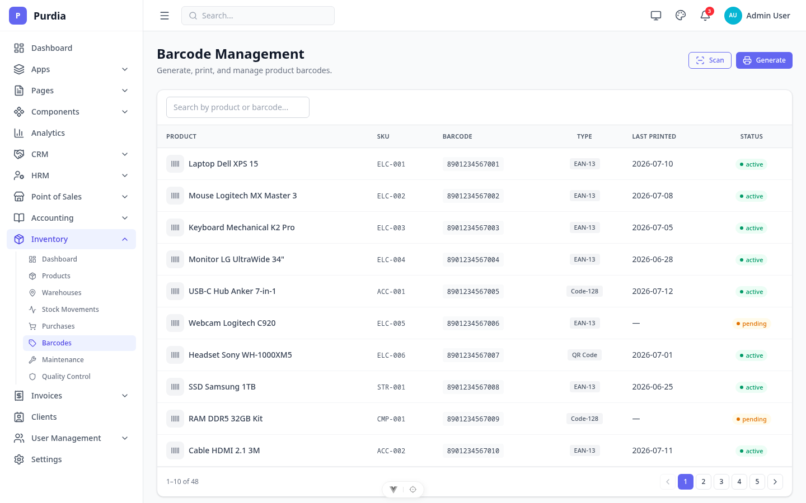
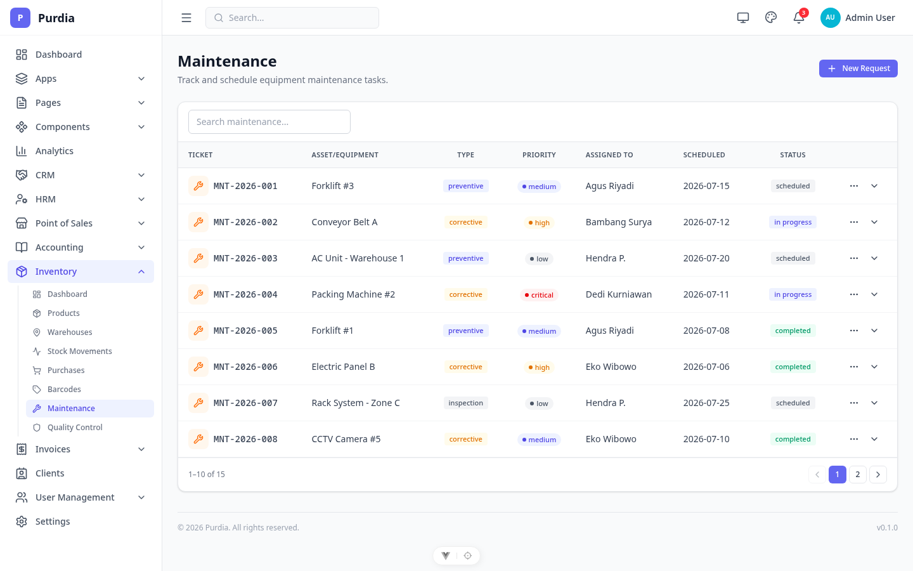
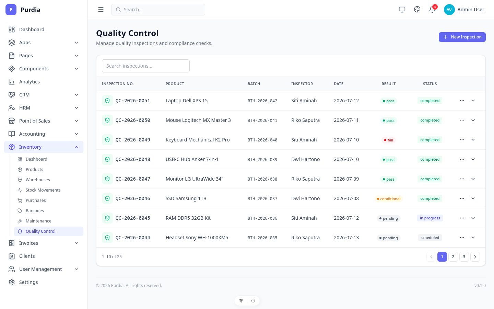

# Inventory

Modul inventory — products, warehouses, stock movements, purchases, barcodes, maintenance, dan quality control.

## Pages

| Page | File | Route |
|------|------|-------|
| Dashboard | `dashboard.png` | `/inventory` |
| Products | `products.png` | `/inventory/products` |
| Warehouses | `warehouses.png` | `/inventory/warehouses` |
| Stock Movements | `stock-movements.png` | `/inventory/movements` |
| Purchases | `purchases.png` | `/inventory/purchases` |
| Barcodes | `barcodes.png` | `/inventory/barcodes` |
| Maintenance | `maintenance.png` | `/inventory/maintenance` |
| Quality | `quality.png` | `/inventory/quality` |

## Preview

