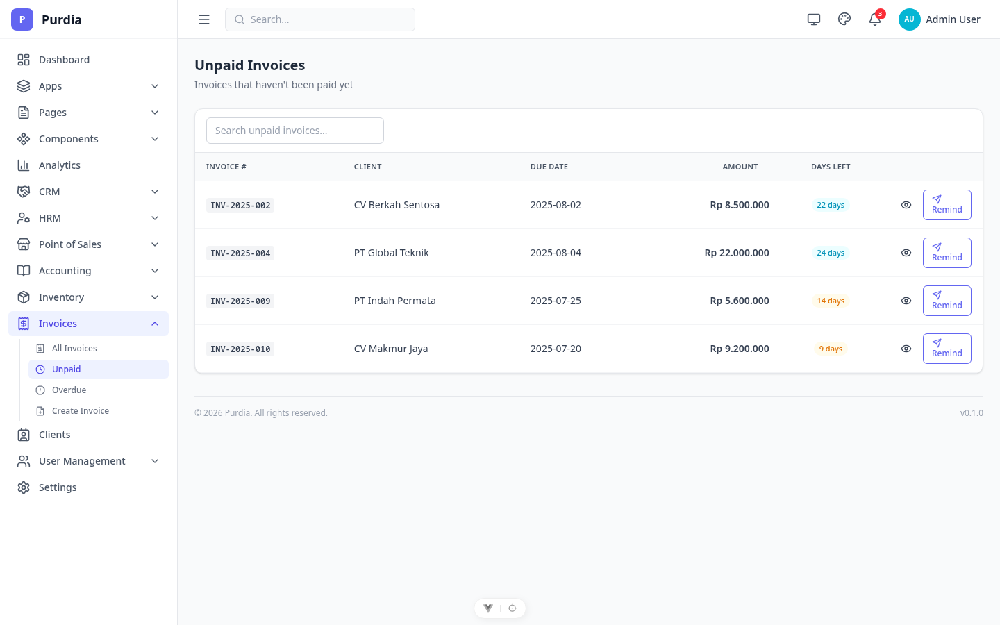
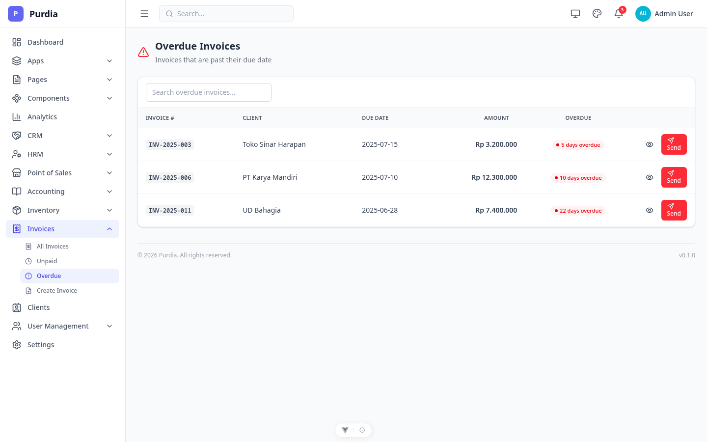
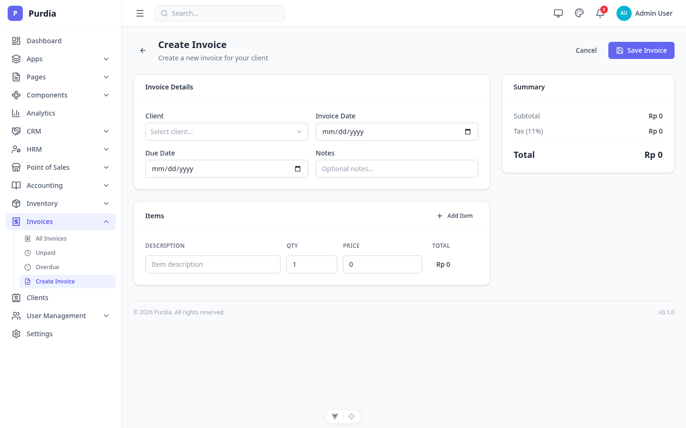

# Invoices

Modul invoice — buat, kelola, dan track invoice (unpaid, overdue).

## Pages

| Page | File | Route |
|------|------|-------|
| List | `list.png` | `/invoices` |
| Unpaid | `unpaid.png` | `/invoices/unpaid` |
| Overdue | `overdue.png` | `/invoices/overdue` |
| Create | `create.png` | `/invoices/create` |

## Preview

