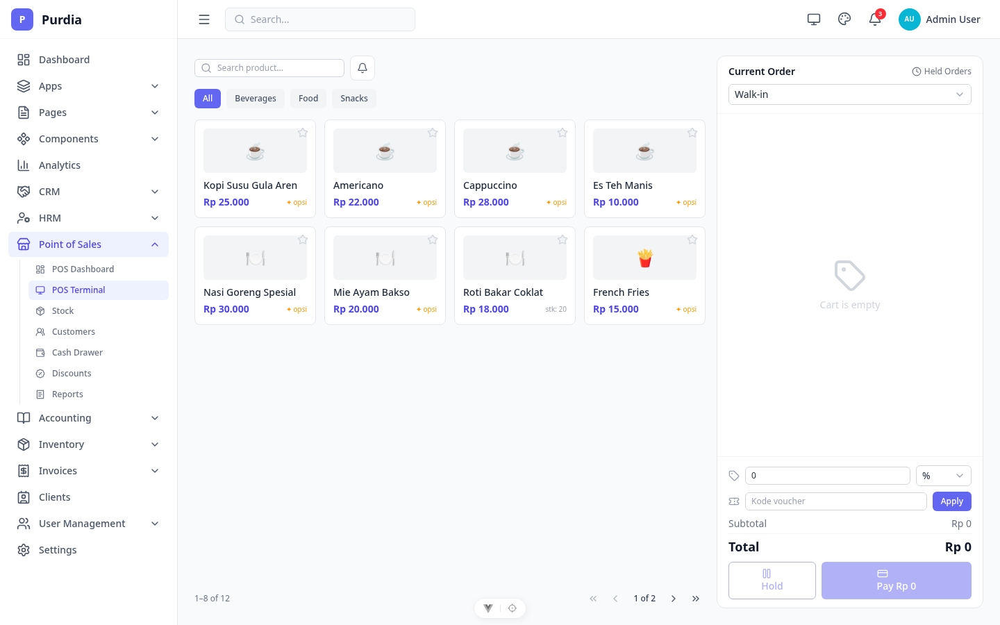
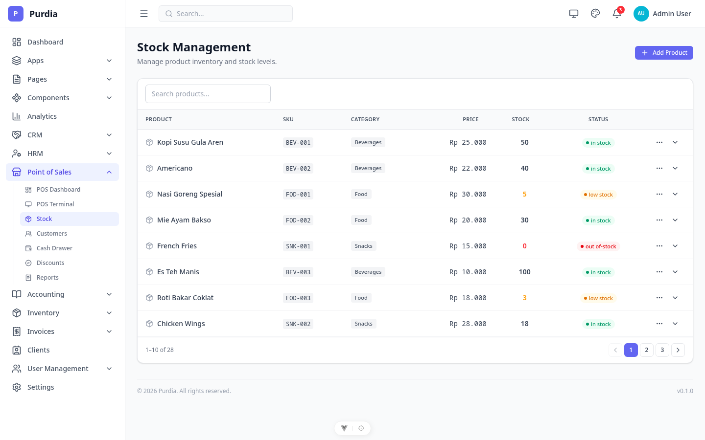
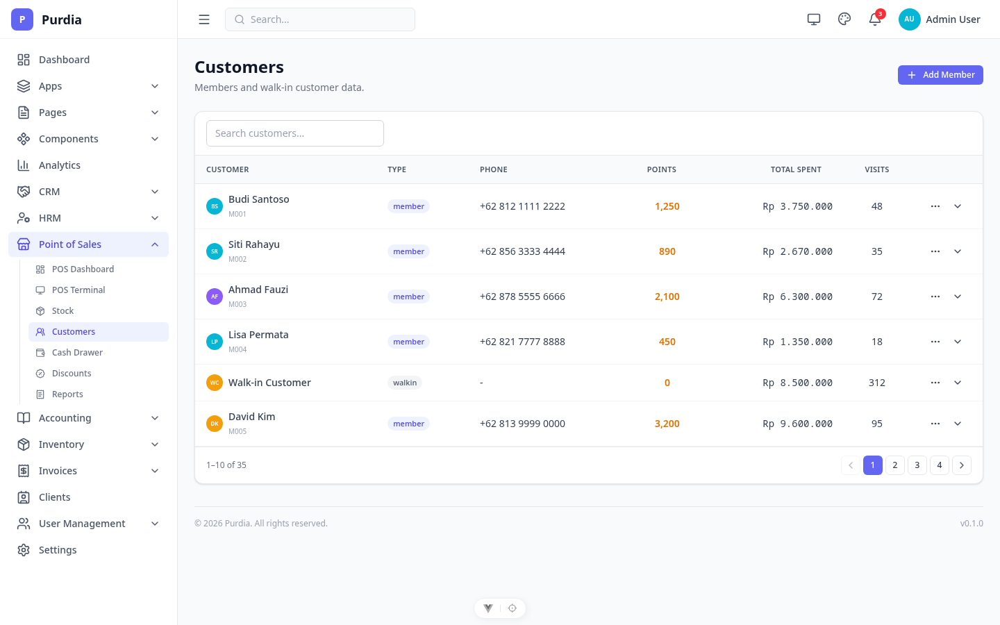
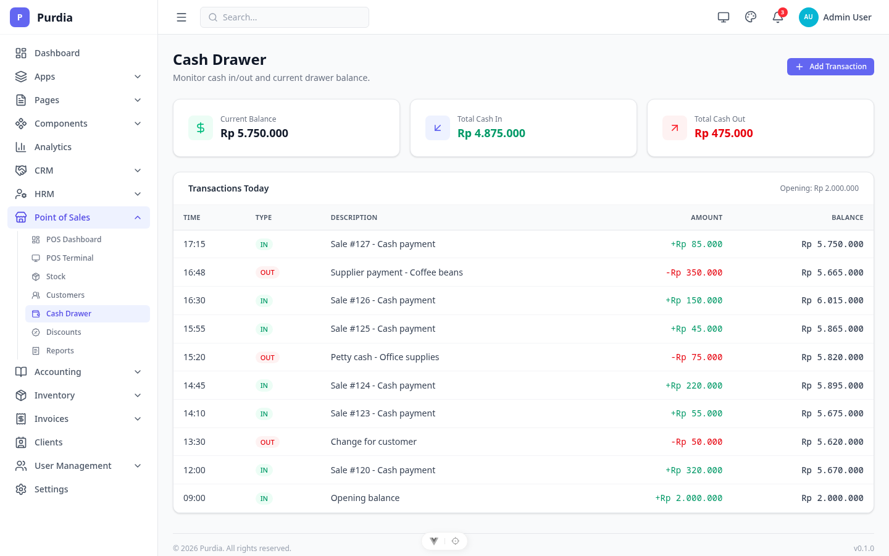
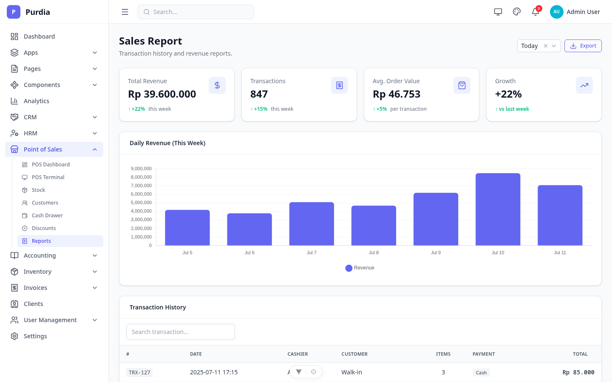

# Point of Sale (POS)

Modul kasir / point of sale dengan terminal, stock management, dan reporting.

## Pages

| Page | File | Route |
|------|------|-------|
| Dashboard | `dashboard.png` | `/pos` |
| Terminal | `terminal.png` | `/pos/terminal` |
| Stock | `stock.png` | `/pos/stock` |
| Customers | `customers.png` | `/pos/customers` |
| Cash Drawer | `cash-drawer.png` | `/pos/cash-drawer` |
| Discounts | `discounts.png` | `/pos/discounts` |
| Reports | `reports.png` | `/pos/reports` |
| QR Codes | `qr-codes.png` | `/pos/qr-codes` |

## Preview

